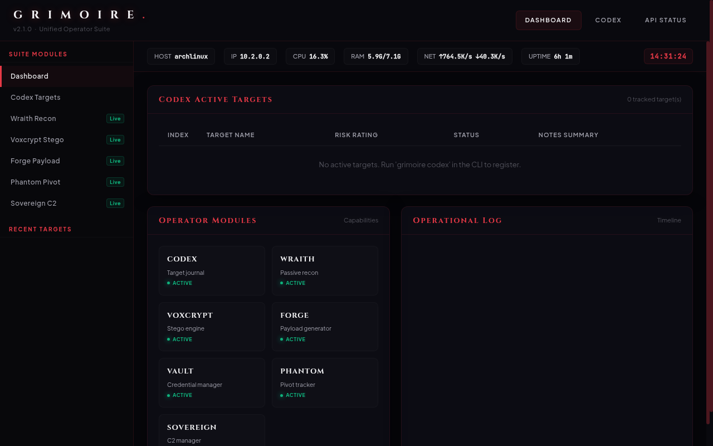

# GRIMOIRE

*"I will write your name in this book."*

GRIMOIRE is a modular, TUI-driven post-exploitation and recon suite with a Death Note aesthetic. Built for red team operators, it handles recon, payload generation, steganography, SSH pivot tracking, C2 multi-sessions, target logging, and basic blue team detection analysis.



---

## Key Modules

| Module | Command | Description |
|--------|---------|-------------|
| 🖥️ **Core** | `grimoire` | Curses-based TUI dashboard and operational logging. |
| 👁️ **Wraith** | `grimoire wraith` | Passive recon: DNS, SSL certs, WAF detection, subdomain takeovers, and Shodan queries. |
| 💣 **Forge** | `grimoire forge` | Interactive generator for 15+ reverse shell templates, encoders, and obfuscators. |
| 🕸️ **Voxcrypt** | `grimoire voxcrypt` | Steganography engine supporting LSB PNG/WAV encoding and zero-width text hiding. |
| 🌐 **Phantom** | `grimoire phantom` | Network pivot hop tracker and SSH/Chisel/Ligolo command generator. |
| ☠️ **Sovereign** | `grimoire sovereign` | C2 session manager and multi-session TCP shell handler. |
| 📓 **Codex** | `grimoire codex` | Target journal with risk scoring and Markdown reporting. |
| 🛡️ **Sentinel** | `grimoire sentinel` | Blue team utility parsing logs (`auth.log`, web logs, `.evtx`) with AbuseIPDB/VT scanners. |
| 🔐 **Vault** | `grimoire vault` | A lightweight KeePassXC CLI credential search wrapper. |
| 🌍 **Web** | `grimoire web` | Flask-based local operational web dashboard. |
| ⚡ **Omega** | `grimoire omega` | Post-exploitation posturing modules (Ghost Hollow, Silicon Death, Data Harvester). |

---

## Installation

Requires Python 3.8+ (Linux recommended).

```bash
git clone https://github.com/ne0k1r4/grimoire.git
cd grimoire
pip install -e .
```
*Note: Run `pip install -e .[evtx]` if you need Windows Event Log parsing capabilities.*

---

## Quick Start

Launch the main terminal user interface:
```bash
grimoire
```

Launch the local web dashboard:
```bash
grimoire web
```

Or invoke modules directly via CLI:
```bash
grimoire wraith target.com
grimoire sentinel --scan /var/log
grimoire forge
```
Use `grimoire <module> --help` to check options and flags for specific tools.

---

## Data Directories

By default, GRIMOIRE writes session data, reports, and configs to `~/.grimoire/`:
- `config.json` — API keys for external services (Shodan, AbuseIPDB, VirusTotal)
- `codex.json` — Active target database
- `oplog.json` — Operational timeline log
- `phantom.json` — Pivot map paths
- `reports/` — Exported markdown/HTML reports

---

## Disclaimer
Designed strictly for authorized penetration testing, CTF challenges, and educational research. The developer assumes no liability for misuse.

*"From here, I will change the world." — Light Yagami*
