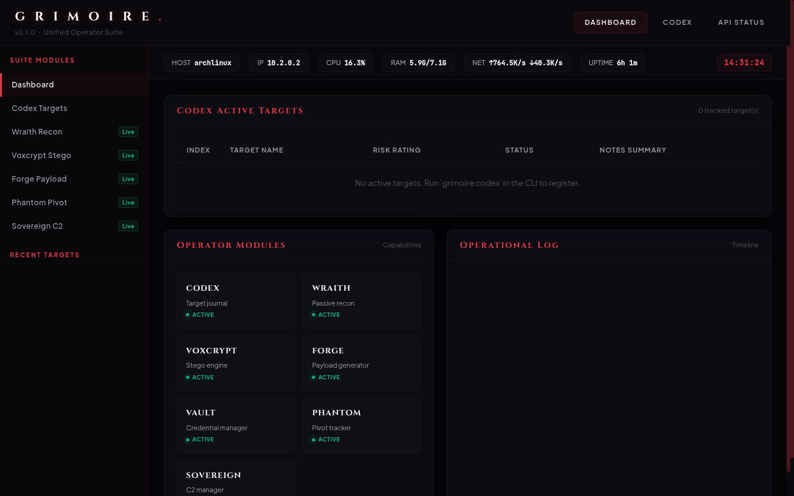

# GRIMOIRE

*"I will write your name in this book."*

A modular, TUI-driven recon and post-exploitation suite with a Death Note
aesthetic. Built for red team operators who like their tooling to feel like
an anime opening sequence — everything ships with a gradient banner and a
scanline print delay, because why not.



## What's inside

| Module        | What it does                                                        |
|---------------|---------------------------------------------------------------------|
| **Core**      | Curses TUI dashboard, oplog ring buffer, sysinfo, report builder    |
| **Wraith**    | Passive recon — DNS, WHOIS, SSL, HTTP fingerprint, WAF, takeover    |
| **Forge**     | Interactive payload generator (15+ templates, encoders, obfuscation)|
| **Voxcrypt**  | LSB steganography engine (image/audio) + ZWC text hiding            |
| **Phantom**   | Network pivot chain tracker                                         |
| **Sovereign** | C2 multi-session TCP shell handler                                  |
| **Codex**     | Target journal with risk scoring                                    |
| **Sentinel**  | Blue team — auth.log / syslog / EVTX / web log analysis + IOC scan  |
| **Vault**     | KeePassXC credential wrapper + password generator                   |
| **Web**       | Flask operational dashboard on `localhost:1337`                     |
| **Omega**     | Post-exploitation modules — Ghost Hollow, Silicon Death, Data Harvest|

## Setup

```bash
git clone https://github.com/ne0k1r4/grimoire.git
cd grimoire
pip install -e .
# optional Windows Event Log support:
pip install -e .[evtx]
```

Drop your API keys into `config.json` (see `config.example.json`):

```json
{
  "shodan_api_key": "…",
  "abuseipdb_api_key": "…",
  "virustotal_api_key": "…"
}
```

## Quick start

- Launch the TUI: `grimoire`
- Launch the web dashboard: `grimoire web`
- Direct module call: `grimoire wraith example.com`

Everything logs to `~/.grimoire/` — oplog, per-target journals, session
captures. Reports come out as markdown.

## Release notes

### 2.1.0
- **Wraith v2.1** — crt.sh certificate transparency, subdomain takeover
  fingerprints (30 services), WAF/CDN detection, Shodan host lookup
- **Sentinel** — log parsers for auth.log, syslog, web logs and EVTX,
  offline IOC scanning + anomaly engine
- **Arsenal Omega** — Ghost Hollow (process hollowing loader), Silicon
  Death (keylogger), Data Harvester (system recon grabber)
- `--help` on every module, config.example.json, banner + web restyle

### 2.0.0
- Initial release — core, TUI, web dashboard, wraith, forge, voxcrypt,
  phantom, sovereign, codex, vault

---

*Educational and authorized testing use only. Don't be dumb with this.*
